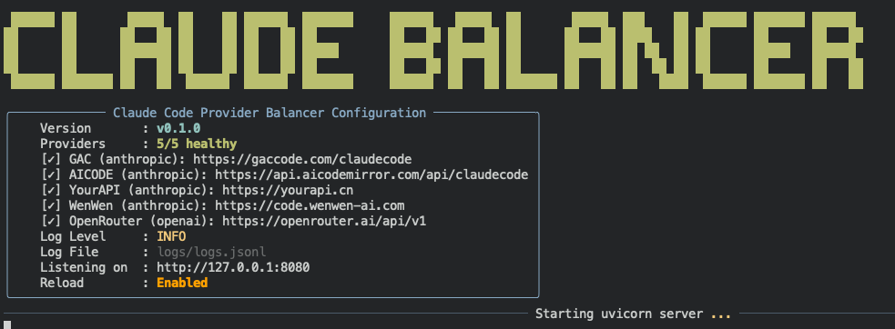

# Claude Code Provider Balancer

智能 Claude Code 代理服务，基于 FastAPI 构建，为多个 Claude 服务提供商提供负载均衡、故障转移和智能路由功能。



## ✨ 核心特性

- **🚀 多提供商支持** - 完美支持 Anthropic API、OpenAI 兼容服务及其他主流供应商
- **⚡ 智能负载均衡** - 错误阈值管理、自动故障转移、实时健康监控、智能提供商选择
- **🔐 OAuth 认证支持** - 集成 Claude Code 官方 OAuth 2.0 认证流程
- **🎯 智能路由系统** - 基于模型名称和优先级的动态路由策略
- **📊 请求去重优化** - 智能缓存机制，自动识别并合并重复请求
- **🔧 热配置重载** - 零停机时间配置更新，即时生效
- **🛡️ 错误阈值处理** - 基于错误计数的智能健康判断，避免误判和频繁切换
- **📈 性能监控** - 详细的性能指标和日志记录

## 🚀 快速开始

### 1. 安装依赖

```bash
# 推荐使用 uv (更快的 Python 包管理器)
uv sync

# 或使用传统 pip 方式
pip install -r requirements.txt
```

### 2. 配置服务

```bash
# 复制示例配置文件
cp config.example.yaml config.yaml

# 编辑配置文件，添加你的 API 密钥和提供商信息
vim config.yaml
```

**配置说明：**
- 添加你的 Anthropic API 密钥
- 配置其他兼容服务的 API 密钥
- 设置提供商优先级和权重
- 配置 OAuth 设置（可选）

### 3. 启动服务

```bash
# 开发模式启动（带热重载）
python src/main.py

# 生产模式启动
uvicorn src.main:app --host 0.0.0.0 --port 9090

# 后台运行
nohup uvicorn src.main:app --host 0.0.0.0 --port 9090 > logs/server.log 2>&1 &
```

### 4. 配置 Claude Code 客户端

```bash
# 设置代理 URL
export ANTHROPIC_BASE_URL=http://localhost:9090

# 启动 Claude Code
claude
```

现在你的 Claude Code 请求将通过负载均衡器处理，享受高可用性和智能路由！


## 🔧 核心功能架构

### 🎯 智能负载均衡系统

- **多提供商管理** - 统一管理多个 Claude Code 服务提供商
- **错误阈值健康检查** - 基于错误计数阈值的智能健康状态判断 (默认阈值=2)
- **智能故障转移** - 达到错误阈值时自动切换，避免单次错误误判
- **错误计数透明化** - 日志显示 `count=1/2` 格式，清晰展示健康状态
- **基于优先级路由** - 根据配置的权重和优先级智能分配请求
- **冷却恢复机制** - 不健康提供商的智能恢复和重试策略 (默认冷却180秒)

### 🔐 OAuth 2.0 认证集成

- **官方认证支持** - 完整兼容 Claude Code 官方 OAuth 2.0 流程
- **自动令牌管理** - 智能 token 刷新和安全持久化存储
- **无缝用户体验** - 透明的认证过程，用户无感知切换
- **多用户支持** - 支持多个用户的并发认证会话

### 📊 请求优化系统

- **智能去重** - 基于请求内容哈希的重复请求识别
- **响应缓存** - 智能缓存机制，显著提升响应速度
- **并发处理** - 多个相同请求自动合并，减少后端压力
- **性能优化** - 异步处理和连接池管理

### 🌐 完整 API 兼容

- **Anthropic Messages API** - 100% 兼容原生 Anthropic API
- **OpenAI 格式转换** - 自动转换 OpenAI 格式请求和响应  
- **流式响应支持** - 完整支持 SSE 流式和非流式响应
- **错误智能处理** - 基于错误类型和HTTP状态码的分类处理

## 📡 API 端点

### 核心消息接口
| 端点 | 方法 | 描述 | 功能 |
|------|------|------|------|
| `/v1/messages` | POST | 发送消息请求 | 智能路由到最佳提供商 |
| `/v1/messages/count_tokens` | POST | 计算 token 数量 | 精确的 token 计费统计 |

### 管理和监控接口
| 端点 | 方法 | 描述 | 功能 |
|------|------|------|------|
| `/providers` | GET | 查看提供商状态 | 实时健康状态和性能指标 |
| `/providers/reload` | POST | 重新加载配置 | 热更新配置无需重启 |
| `/health` | GET | 服务健康检查 | 整体服务状态监控 |

### OAuth 认证接口
| 端点 | 方法 | 描述 | 功能 |
|------|------|------|------|
| `/oauth/status` | GET | OAuth 状态检查 | 认证状态和令牌信息 |
| `/oauth/authorize` | GET | OAuth 授权入口 | 启动 OAuth 认证流程 |
| `/oauth/callback` | GET | OAuth 回调处理 | 处理认证回调和令牌交换 |

## 🧪 开发和测试

### 测试执行
```bash
# 运行完整测试套件
python tests/run_tests.py

# 运行特定测试
python -m pytest tests/test_multi_provider_management.py -v

# 运行模拟服务器进行测试
python tests/run_mock_server.py
```

### 代码质量
```bash
# 代码格式化 (自动修复格式问题)
ruff format src/ tests/

# 代码静态检查
ruff check src/ tests/

# 类型检查 (如果使用 mypy)
mypy src/
```

### 开发工具
```bash
# 开发模式启动 (自动重载)
python src/main.py

# 查看详细日志
tail -f logs/logs.jsonl | jq '.'

# 监控提供商状态
watch -n 2 'curl -s http://localhost:9090/providers | jq .'
```

## 🛠️ 故障排除

### 常见问题解决

| 问题类型 | 症状 | 解决方案 |
|---------|------|----------|
| **提供商连接失败** | 请求总是失败或超时 | • 检查 API 密钥是否正确<br>• 验证网络连接<br>• 查看 `/providers` 状态 |
| **配置不生效** | 修改配置后没有变化 | • 使用 `/providers/reload` 热重载<br>• 检查配置文件语法<br>• 查看启动日志 |
| **OAuth 认证问题** | 认证失败或令牌过期 | • 检查 `/oauth/status` 状态<br>• 验证 OAuth 配置<br>• 重新进行认证流程 |
| **响应慢或超时** | 请求处理时间过长 | • 检查提供商健康状态<br>• 调整超时配置<br>• 查看负载均衡策略 |
| **内存使用过高** | 服务器内存占用异常 | • 检查缓存配置<br>• 清理过期缓存<br>• 重启服务 |

### 实时监控命令

```bash
# 查看所有提供商的实时状态
curl -s http://localhost:9090/providers | jq '.'

# 监控服务健康状态
curl -s http://localhost:9090/health | jq '.'

# 实时查看结构化日志
tail -f logs/logs.jsonl | jq '.'

# 监控系统资源使用
htop  # 或 top

# 查看网络连接状态
netstat -tlnp | grep :9090
```

### 日志分析

```bash
# 筛选错误日志
cat logs/logs.jsonl | jq 'select(.level == "ERROR")'

# 查看最近的认证相关日志
cat logs/logs.jsonl | jq 'select(.message | contains("oauth"))'

# 统计请求数量
cat logs/logs.jsonl | jq 'select(.message | contains("request"))' | wc -l
```

## 🔍 智能健康监控系统

### 错误阈值管理
- **智能错误计数** - 基于错误类型的智能计数，仅对特定错误类型进行计数
- **阈值触发机制** - 达到设定阈值 (默认2次) 后才标记提供商不健康
- **透明日志显示** - 日志格式 `count=1/2` 清晰显示当前状态和阈值
- **避免误判切换** - 防止单次网络抖动导致的不必要提供商切换

### 触发不健康状态的错误类型
```yaml
# 网络和连接错误
- connection_error, timeout_error, ssl_error
- internal_server_error, bad_gateway, service_unavailable
- too_many_requests, rate_limit_exceeded

# 提供商特定错误
- "Insufficient credits", "没有可用token", "无可用模型"

# HTTP状态码
- 402, 404, 408, 429, 500, 502, 503, 504
- 520-524 (Cloudflare错误)
```

### 健康恢复机制
- **冷却期管理** - 不健康提供商进入180秒冷却期
- **自动恢复检测** - 冷却期结束后自动尝试恢复
- **错误计数重置** - 成功请求后重置错误计数
- **渐进式恢复** - 逐步验证提供商健康状态

## 🏗️ 技术架构特性

### 核心技术栈
- **🐍 Python 3.8+** - 现代 Python 异步编程
- **🚀 FastAPI** - 高性能 Web 框架，自动 API 文档
- **⚡ Asyncio** - 原生异步编程，高并发处理
- **🔍 Pydantic** - 数据验证和序列化
- **📦 UV** - 快速的 Python 包管理器

### 架构设计原则
- **🎯 模块化设计** - 清晰的代码组织和职责分离
- **⚡ 高性能异步** - 基于 asyncio 的非阻塞 I/O 处理
- **🛡️ 类型安全** - 完整的 Pydantic 模型验证和类型注解
- **📊 可观测性** - 结构化日志、性能监控和链路追踪
- **🔧 高可用性** - 自动故障转移、健康检测和优雅降级
- **🔄 热更新** - 零停机时间的配置更新和服务管理

### 项目结构
```
src/
├── main.py              # 应用入口和 FastAPI 实例
├── core/                # 核心业务逻辑
│   ├── provider_manager/    # 提供商管理模块
│   │   ├── manager.py       # 提供商生命周期管理
│   │   └── health.py        # 错误阈值健康检查
│   └── streaming/       # 流式响应处理
├── routers/             # API 路由定义
│   └── messages/        # 消息处理路由
├── handlers/            # 请求处理器
│   └── message_handler.py   # HTTP通信和格式转换
├── models/              # Pydantic 数据模型
├── oauth/               # OAuth 认证管理
├── caching/             # 缓存和去重逻辑
├── conversion/          # 格式转换 (Anthropic ↔ OpenAI)
└── utils/               # 工具类和结构化日志
```

## 📄 许可证

MIT License - 详见 [LICENSE](./LICENSE) 文件

---

⭐ **如果这个项目对你有帮助，请给一个 Star！**

🤝 **欢迎提交 Issue 和 Pull Request 来改进项目！**
