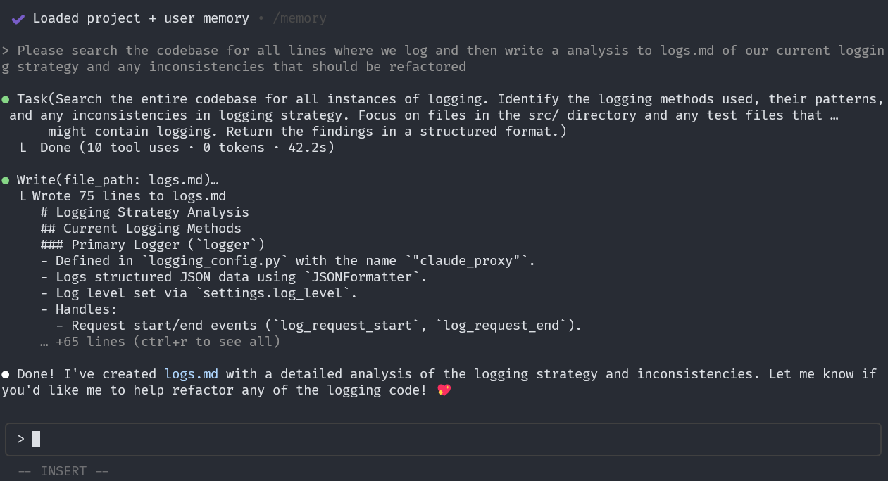

# Claude Code Provider Balancer

A load balancing proxy service for Claude Code that supports multiple Claude Code providers and OpenAI-compatible services with automatic failover and retry mechanisms.


## Overview

Claude Code Provider Balancer provides intelligent load balancing and failover between multiple Claude Code providers and OpenAI-compatible services. It seamlessly switches between providers when one becomes unavailable, ensuring high availability for your Claude Code applications.

Key features:

- **Multi-provider support**: Both Anthropic API-compatible and OpenAI-compatible providers
- **Automatic failover**: Switches to healthy providers when failures occur
- **Load balancing**: Distributes requests across available providers
- **Health monitoring**: Tracks provider status with configurable cooldown periods
- **Dual authentication**: Supports both `ANTHROPIC_API_KEY` and `ANTHROPIC_AUTH_TOKEN`
- **Dynamic model selection**: Maps Claude models to provider-specific models
- **Real-time configuration**: Reload provider config without restart
- **Comprehensive logging**: Detailed request/response tracking
- **Token counting**: Built-in token estimation
- **Streaming support**: Full support for streaming responses

## Example

**Model**: `deepseek/deepseek-chat-v3-0324`



## Getting Started

### Prerequisites

- Python 3.10+
- API keys for your chosen providers
- [uv](https://github.com/astral-sh/uv) (recommended) or pip

### Configuration

The system uses a YAML configuration file (`providers.yaml`) to manage multiple providers:

```yaml
providers:
  # Anthropic official API
  - name: "anthropic_official"
    type: "anthropic"
    base_url: "https://api.anthropic.com"
    auth_type: "api_key"
    auth_value: "sk-ant-your-key-here"
    big_model: "claude-3-5-sonnet-20241022"
    small_model: "claude-3-5-haiku-20241022"
    enabled: true
    
  # Custom Claude Code provider with auth_token
  - name: "claude_provider_custom"
    type: "anthropic"
    base_url: "https://your-claude-provider.com"
    auth_type: "auth_token"
    auth_value: "your-auth-token-here"
    big_model: "claude-3-5-sonnet-20241022"
    small_model: "claude-3-5-haiku-20241022"
    enabled: true
    
  # OpenAI-compatible provider (e.g., OpenRouter)
  - name: "openrouter"
    type: "openai"
    base_url: "https://openrouter.ai/api/v1"
    auth_type: "api_key"
    auth_value: "sk-or-your-openrouter-key"
    big_model: "google/gemini-2.5-pro-preview"
    small_model: "google/gemini-2.0-flash-lite-001"
    enabled: true

settings:
  failure_cooldown: 60  # seconds
  request_timeout: 30   # seconds
  log_level: "DEBUG"
  host: "127.0.0.1"
  port: 8080
```

Copy `providers.example.yaml` to `providers.yaml` and configure your providers.

#### Authentication Types

- **`api_key`**: Standard API key authentication (for Anthropic official API and OpenAI-compatible services)
- **`auth_token`**: Bearer token authentication (for some Claude Code provider services)

#### Provider Types

- **`anthropic`**: Direct Anthropic API-compatible providers
- **`openai`**: OpenAI-compatible providers (requests are converted from Anthropic to OpenAI format)

### Running the Server

```bash
# Install dependencies
uv sync

# Run the server (from project root)
uv run src/main.py
```

Or with traditional pip:

```bash
pip install -r requirements.txt

# Option 1: Run from project root (recommended)
python src/main.py

# Option 2: Run from src directory
cd src && python main.py
```

### Running Claude Code

Point Claude Code to your balancer:

```bash
ANTHROPIC_BASE_URL=http://localhost:8080 claude
```

## Usage

### API Endpoints

The proxy server exposes the following endpoints:

- `POST /v1/messages`: Create a message (main endpoint with automatic provider selection)
- `POST /v1/messages/count_tokens`: Count tokens for a request
- `GET /`: Health check endpoint
- `GET /providers`: Get provider status and health information
- `POST /providers/reload`: Reload provider configuration without restart

### Load Balancing Behavior

1. **Normal operation**: Uses the first healthy provider consistently
2. **Provider failure**: Automatically switches to the next healthy provider
3. **Cooldown period**: Failed providers are excluded for 60 seconds (configurable)
4. **Full recovery**: All providers become available again after cooldown expires
5. **No healthy providers**: Returns 503 error when all providers are down

### Model Selection

The system automatically maps Claude model requests to provider-specific models:

- **Big models** (Opus, Sonnet): Uses each provider's `big_model` configuration
- **Small models** (Haiku): Uses each provider's `small_model` configuration
- **Unknown models**: Defaults to big model with warning

### Testing

Run the included test suite:

```bash
# Start the server first (from project root)
python src/main.py

# In another terminal, run tests
python test_api.py
```

## License

[LICENSE](./LICENSE)
