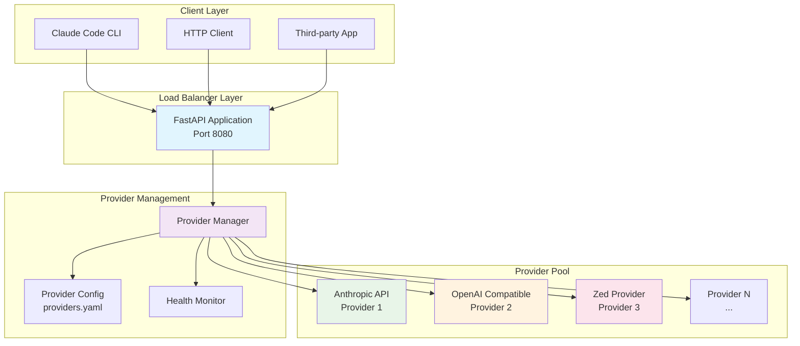
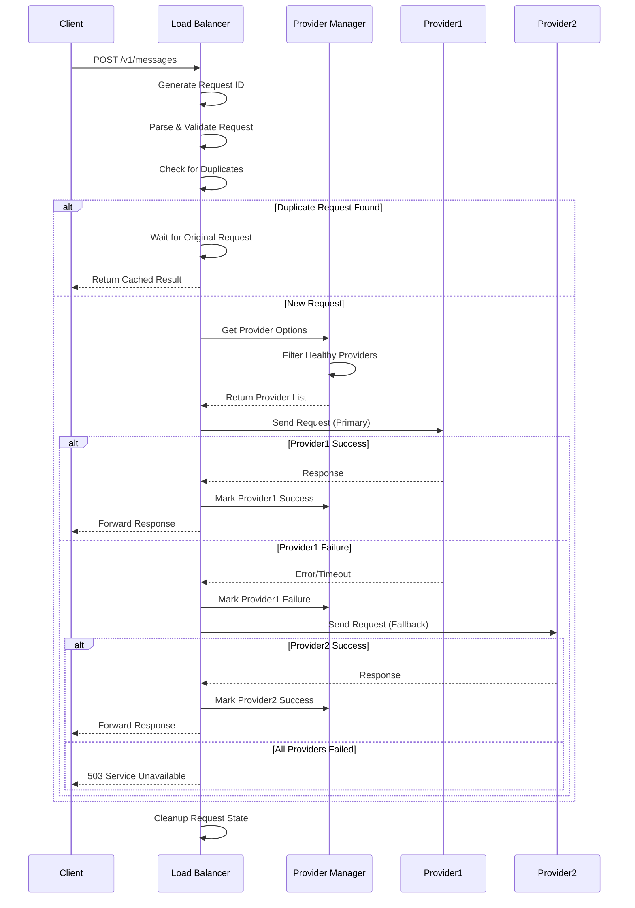
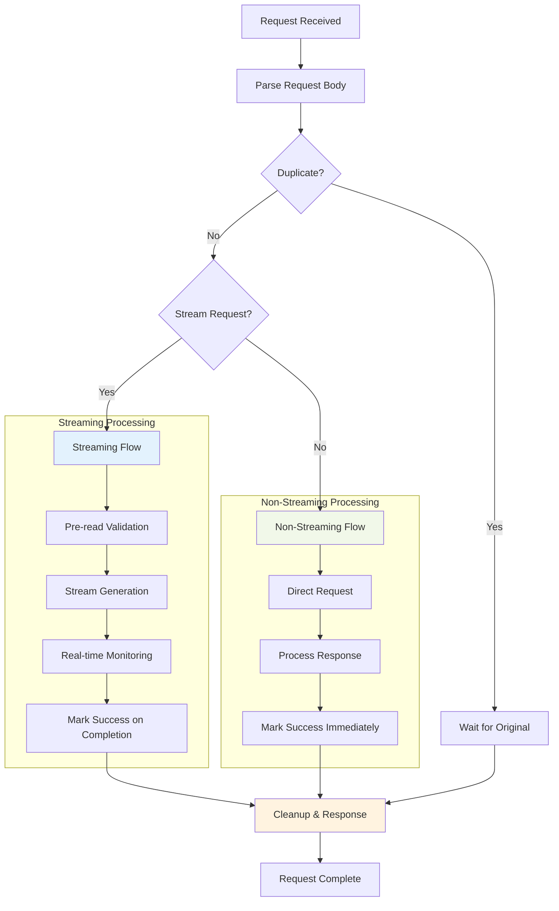
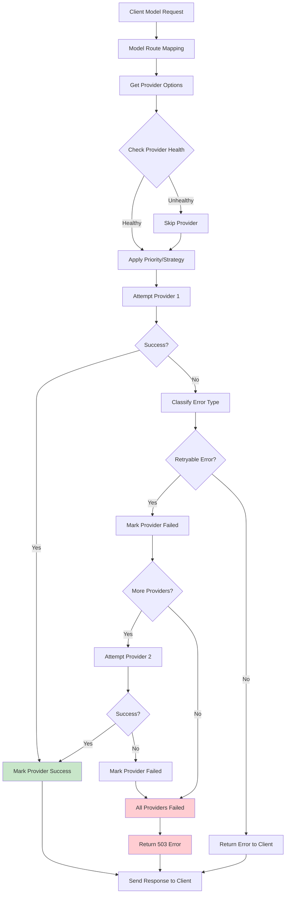
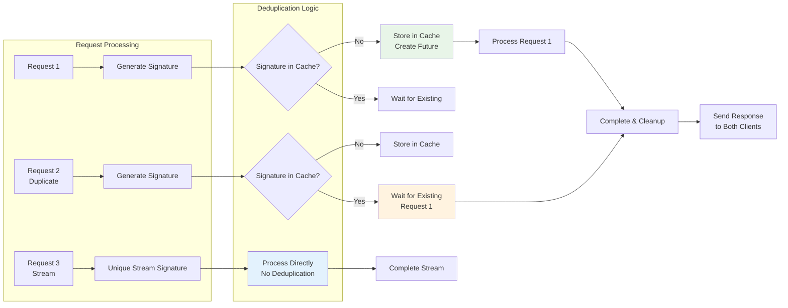
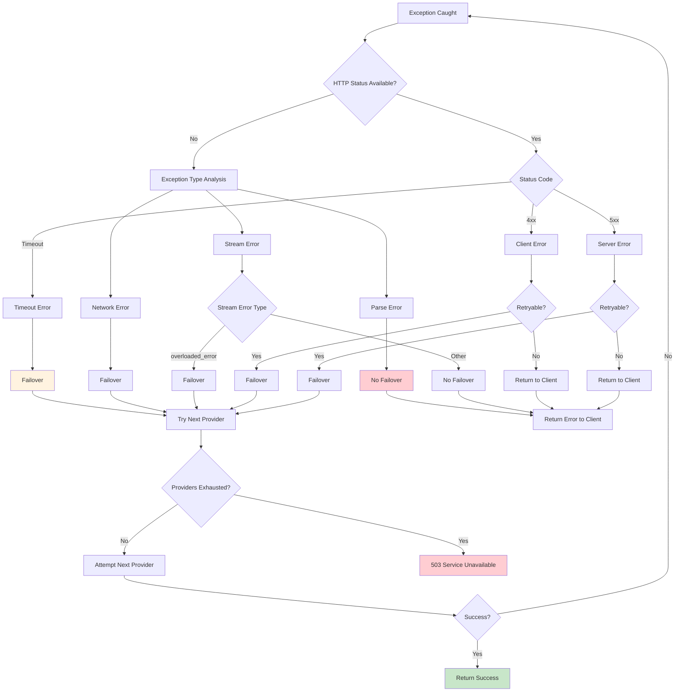
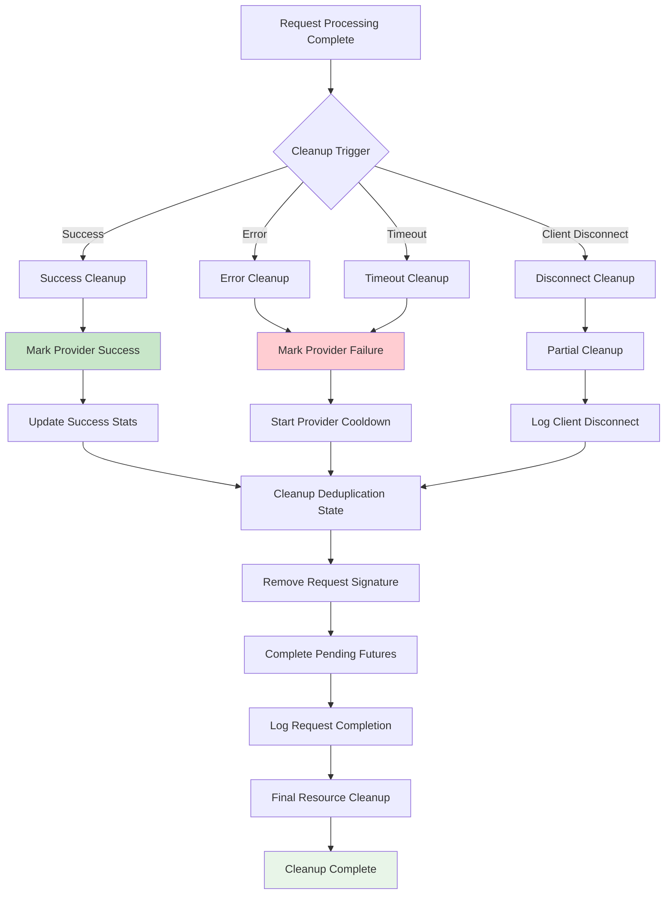

# Request Processing Architecture Diagram

## System Architecture Overview

## Detailed Request Processing Flow

## Stream vs Non-Stream Processing

## Provider Selection and Failover

## Request Deduplication Mechanism

## Error Handling and Classification

## Resource Cleanup Process

These diagrams provide a comprehensive visual representation of the request processing architecture, covering all major flows and decision points in the system.