# Claude Code Provider Balancer - Architecture Diagrams

## System Architecture Overview

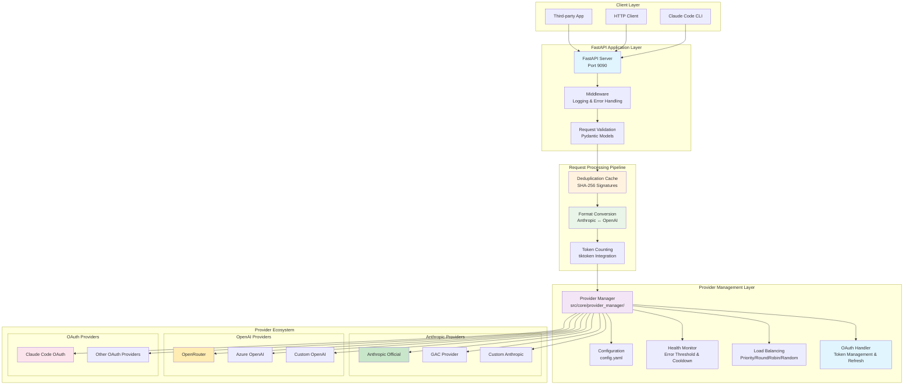

## Detailed Request Processing Flow

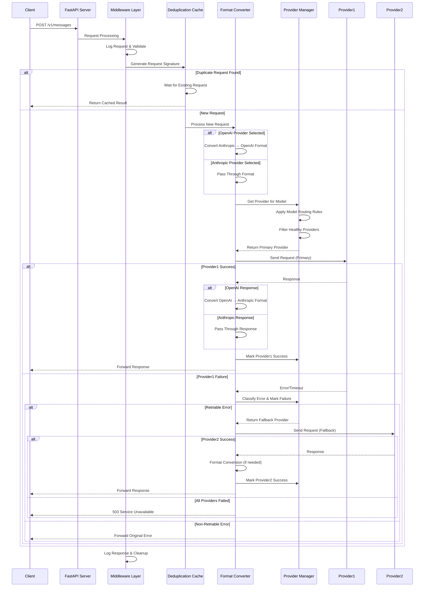

## Stream vs Non-Stream Processing

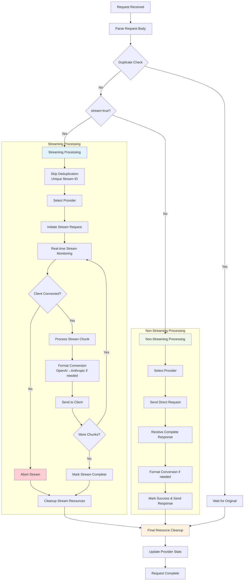

## Format Conversion Architecture

```mermaid
graph TD
    subgraph "Request Format Conversion"
        AnthropicReq[Anthropic Request<br/>from Client] --> ModelRoute[Model Route<br/>Lookup]
        ModelRoute --> ProviderType{Provider Type}
        
        ProviderType -->|anthropic| PassThrough[Pass Through<br/>No Conversion]
        ProviderType -->|openai| ConvertReq[Convert to OpenAI Format]
        ProviderType -->|zed| ZedConvert[Convert to Zed Format]
        
        ConvertReq --> MessageConv[Convert Messages<br/>role, content, tools]
        MessageConv --> ToolConv[Convert Tool Definitions<br/>function → tools]
        ToolConv --> SystemConv[Convert System Message<br/>system → messages[0]]
        SystemConv --> OpenAIReq[OpenAI Compatible Request]
    end
    
    subgraph "Response Format Conversion"
        OpenAIResp[OpenAI Response] --> RespType{Response Type}
        AnthropicResp[Anthropic Response] --> DirectResp[Direct Response<br/>to Client]
        ZedResp[Zed Response] --> ZedRespConv[Convert from Zed]
        
        RespType -->|streaming| StreamConv[Stream Conversion]
        RespType -->|non-streaming| DirectConv[Direct Conversion]
        
        StreamConv --> StreamChunkConv[Convert Each Chunk<br/>delta → content_block_delta]
        StreamChunkConv --> AnthropicStream[Anthropic Stream Format]
        
        DirectConv --> ContentConv[Convert Content<br/>choices → content]
        ContentConv --> UsageConv[Convert Usage<br/>usage → usage]
        UsageConv --> AnthropicResp2[Anthropic Response Format]
        
        ZedRespConv --> AnthropicResp3[Anthropic Response Format]
    end
    
    PassThrough --> DirectProvider[Direct to Provider]
    OpenAIReq --> OpenAIProvider[OpenAI Provider]
    ZedConvert --> ZedProvider[Zed Provider]
    
    DirectProvider --> AnthropicResp
    OpenAIProvider --> OpenAIResp
    ZedProvider --> ZedResp
    
    AnthropicStream --> Client[Client Response]
    AnthropicResp2 --> Client
    AnthropicResp3 --> Client
    DirectResp --> Client
    
    style ConvertReq fill:#fff3e0
    style StreamConv fill:#e3f2fd
    style PassThrough fill:#c8e6c9
    style Client fill:#e8f5e8
```

## Provider Selection and Failover

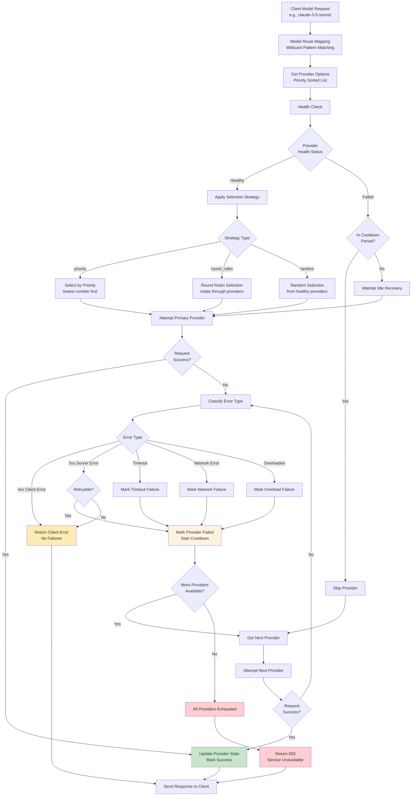

## Request Deduplication Mechanism

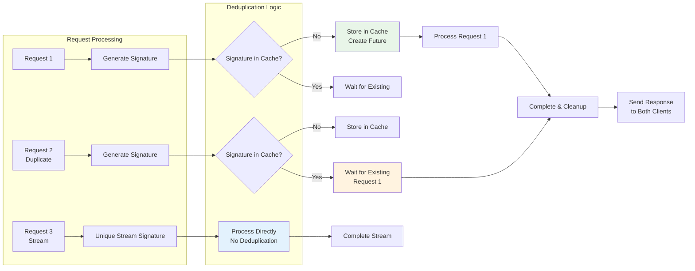

## Error Handling and Classification

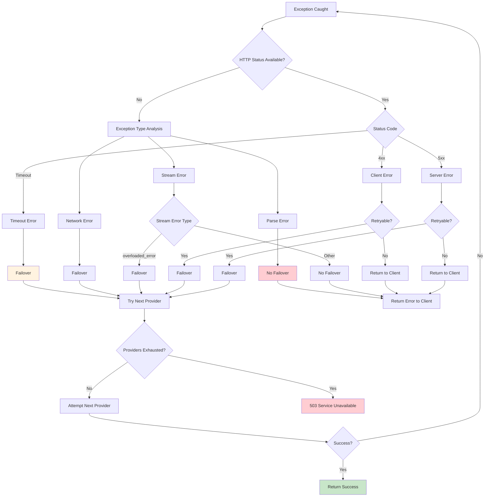

## Resource Cleanup Process

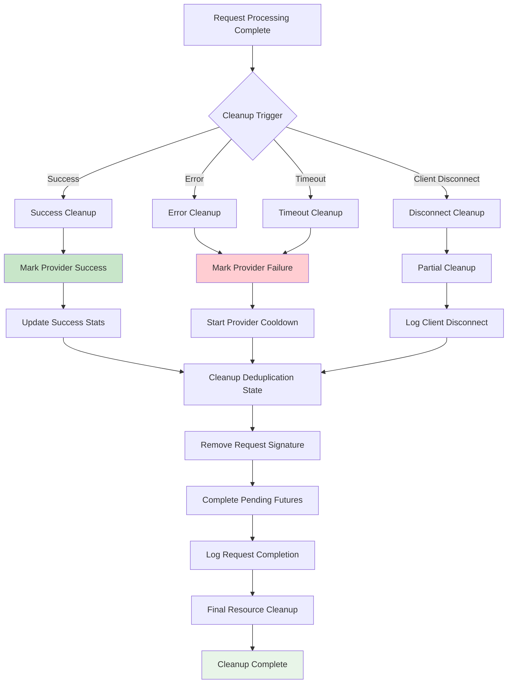

## Complete Data Flow Architecture

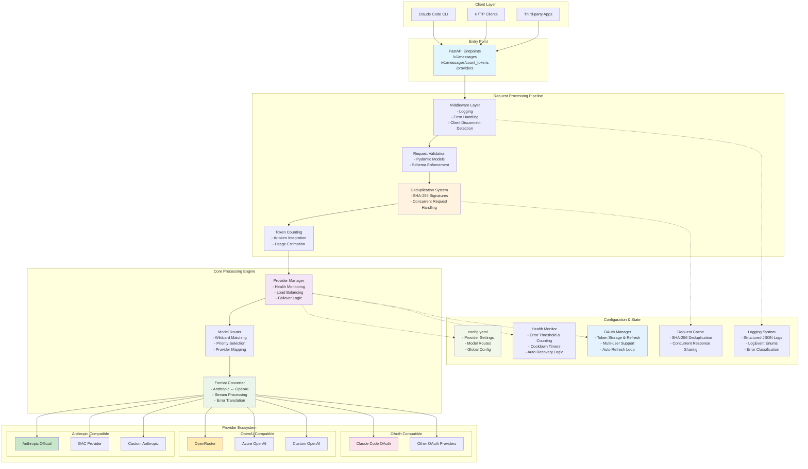

## Configuration Hot Reload Flow

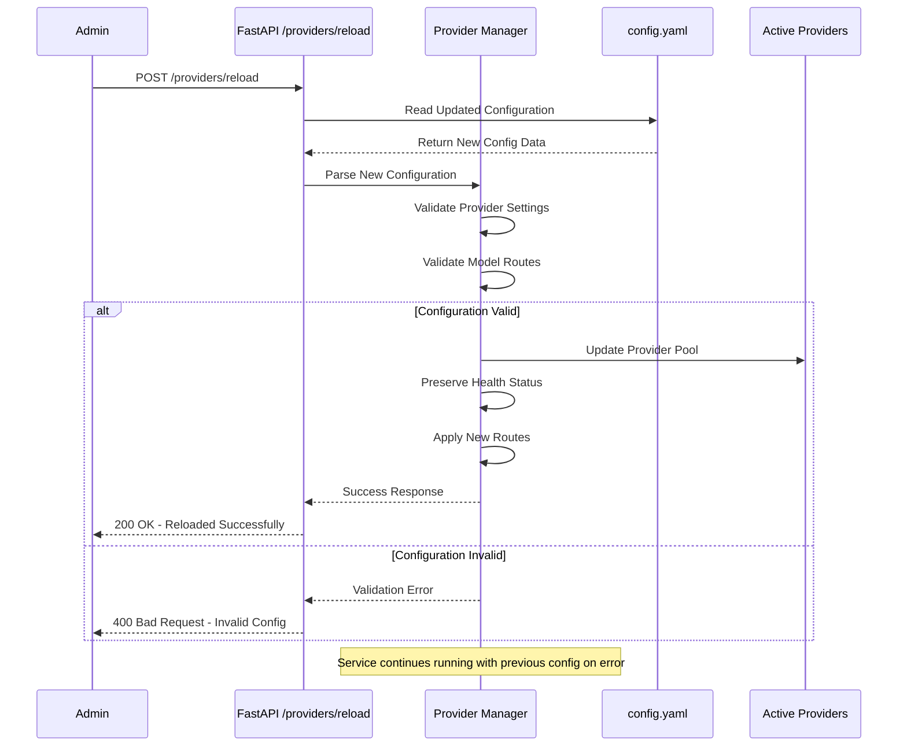

## Health Check and Error Threshold System

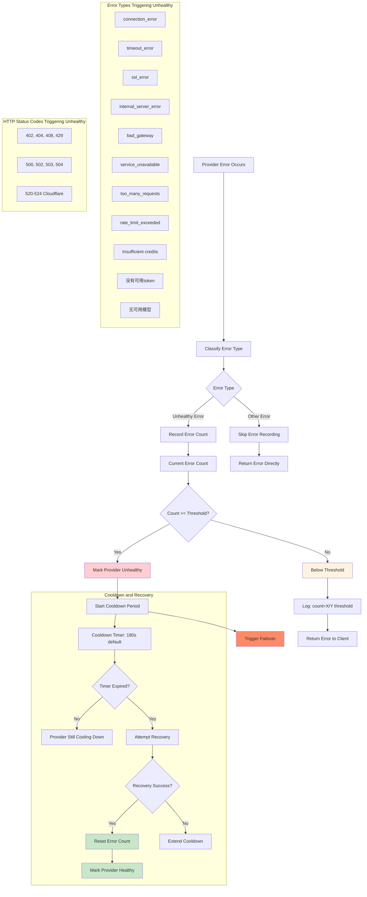

## OAuth Flow Integration

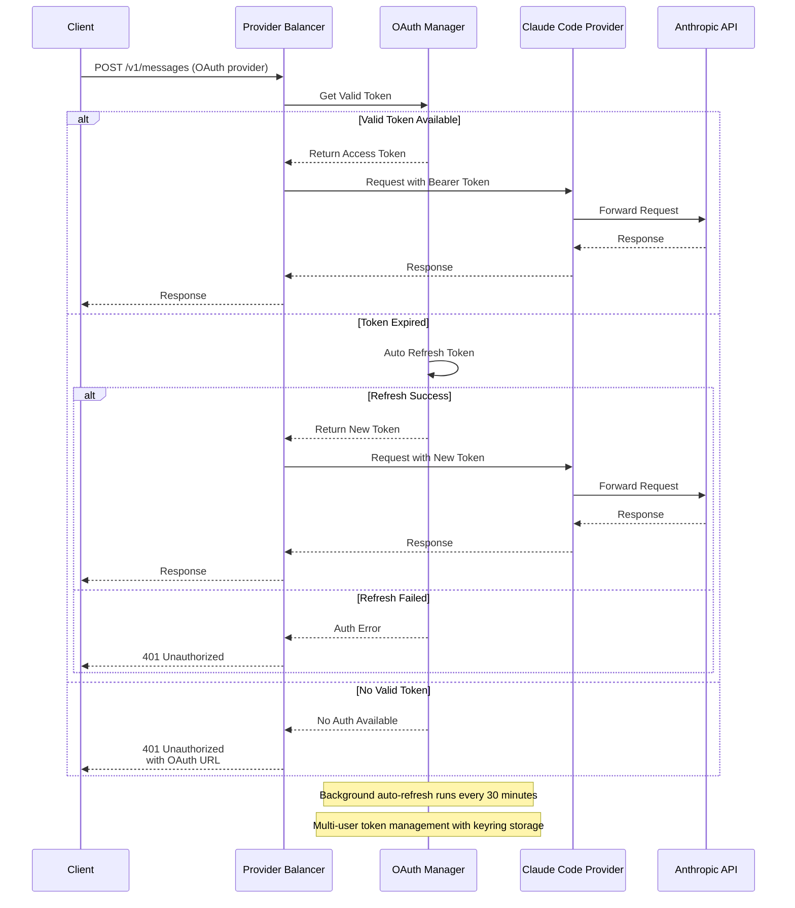

These diagrams provide a comprehensive visual representation of the Claude Code Provider Balancer architecture, covering all major flows, decision points, and system interactions including the latest health check threshold system and OAuth integration.