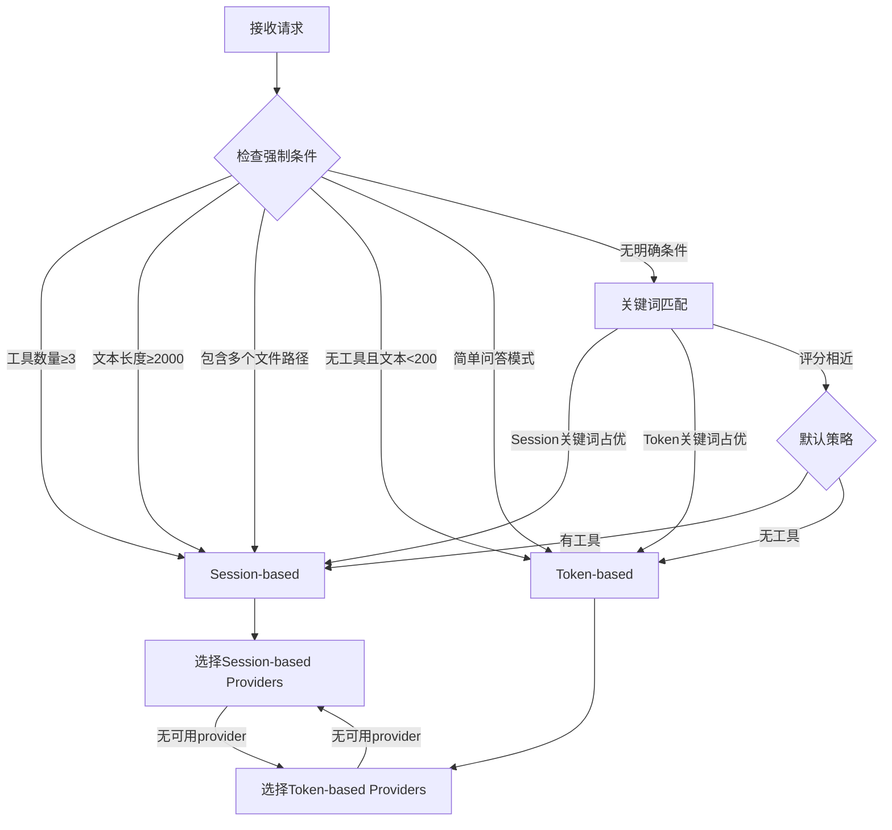

# 智能路由架构设计

## 概述

本文档描述Claude Code Provider Balancer的智能路由架构，该架构旨在根据请求特征自动选择最优的计费模式，最大化不同provider类型的优势。

## 架构背景

### 两种计费模式

现代AI服务提供商采用两种主要的计费模式：

1. **Token-based Providers（按Token计费）**
   - 传统模式：Claude API、OpenAI API等
   - 按输入/输出token数量精确计费
   - 每次请求独立，无状态
   - 适合简单查询和短对话

2. **Session-based Providers（按Session计费）**
   - 新兴模式：Zed、未来可能出现的类似服务
   - 按prompt次数固定计费
   - 支持session内多次交互
   - 允许一定数量的工具调用（通常25次）
   - 大上下文窗口（通常120k tokens）

### 成本对比分析

| 场景 | Token-based成本 | Session-based成本 | 最优选择 |
|------|----------------|------------------|----------|
| 简单问答（<1k tokens） | ~$0.01 | $0.04 | Token-based |
| 代码生成（2-5k tokens） | ~$0.02-0.05 | $0.04 | 平衡 |
| 多工具调用（5-25次） | $0.05-0.20 | $0.04 | Session-based |
| 大上下文分析（>50k tokens） | $0.15+ | $0.04 | Session-based |
| 复杂交互任务 | $0.10+ | $0.04 | Session-based |

## 智能路由策略

### 核心设计原则

1. **明确性优于预估**：基于可观测的请求特征，避免复杂的成本预估
2. **简单规则优于复杂算法**：使用清晰的条件判断，便于理解和调试
3. **渐进式启用**：支持可选开启，不影响现有功能
4. **容错机制**：总是有fallback选项，确保服务可用性

### 路由决策流程



### 强制条件规则

#### 强制使用Session-based

1. **工具密集型任务**：`tools.length >= 3`
   - 多个工具通常意味着复杂的多步骤操作
   - Session-based的25次工具调用限制更适合

2. **长文本任务**：`text_length >= 2000`
   - 长描述通常对应复杂任务
   - 可能需要大上下文窗口

3. **多文件处理**：检测到2个以上文件路径
   - 文件操作通常需要多次工具调用
   - 上下文需要保持文件内容

#### 强制使用Token-based

1. **简单问答**：`text_length <= 200 && has_question_mark`
   - 短问题通常只需简单回答
   - Token-based成本更低

2. **无工具任务**：`tools.length == 0 && text_length < 500`
   - 纯文本生成任务
   - 不需要session维护成本

### 关键词匹配策略

#### Session-based优势关键词
```yaml
session_keywords:
  high_priority:    # 权重2
    - "搜索"        # 通常需要多次搜索操作
    - "分析"        # 分析任务往往复杂
    - "调试"        # 调试需要多步骤操作
    - "扫描"        # 扫描操作通常批量进行
  
  medium_priority:  # 权重1
    - "项目"        # 项目级操作通常复杂
    - "步骤"        # 多步骤任务
    - "继续"        # 连续对话
    - "遍历"        # 遍历操作通常需要多次调用
```

#### Token-based优势关键词
```yaml
token_keywords:
  high_priority:    # 权重2
    - "什么是"      # 简单概念解释
    - "如何"        # 简单how-to问题
    - "解释"        # 解释类请求
  
  medium_priority:  # 权重1
    - "写一个"      # 简单生成任务
    - "创建一个"    # 单一创建任务
    - "定义"        # 定义类问题
```

## 实现架构

### 类型定义

```python
from enum import Enum
from typing import Dict, Any, List
from dataclasses import dataclass

class BillingModel(str, Enum):
    TOKEN_BASED = "token_based"
    SESSION_BASED = "session_based"

class ProviderType(str, Enum):
    # Token-based providers
    ANTHROPIC = "anthropic"
    OPENAI = "openai"
    
    # Session-based providers  
    ZED = "zed"

class RouteDecision(str, Enum):
    TOKEN_BASED = "token_based"
    SESSION_BASED = "session_based"

@dataclass
class SessionConfig:
    max_context_tokens: int = 120000
    max_tool_calls_per_session: int = 25
    session_ttl: int = 3600
    default_mode: str = "normal"
    auto_rotate_threshold: float = 0.8

@dataclass
class Provider:
    name: str
    type: ProviderType
    billing_model: BillingModel
    base_url: str
    auth_type: AuthType
    auth_value: str
    enabled: bool = True
    proxy: Optional[str] = None
    
    # Session-based provider配置
    session_config: Optional[SessionConfig] = None
    
    # Token-based provider状态
    failure_count: int = 0
    last_failure_time: float = 0
```

### 路由器实现

```python
class SimpleRouter:
    def route_request(self, request: Dict[str, Any]) -> RouteDecision:
        tools = request.get('tools', [])
        text_content = self._extract_text(request.get('messages', []))
        
        # 强制条件检查
        if len(tools) >= 3:
            return RouteDecision.SESSION_BASED
            
        if len(text_content) >= 2000:
            return RouteDecision.SESSION_BASED
            
        if self._has_multiple_file_paths(text_content):
            return RouteDecision.SESSION_BASED
            
        if len(text_content) <= 200 and self._is_simple_question(text_content):
            return RouteDecision.TOKEN_BASED
        
        # 关键词匹配
        session_score = self._calculate_keyword_score(text_content, self.session_keywords)
        token_score = self._calculate_keyword_score(text_content, self.token_keywords)
        
        if session_score > token_score + 1:
            return RouteDecision.SESSION_BASED
        elif token_score > session_score + 1:
            return RouteDecision.TOKEN_BASED
        else:
            # 默认策略
            return RouteDecision.SESSION_BASED if tools else RouteDecision.TOKEN_BASED
```

## 配置格式

### Provider配置

```yaml
providers:
  # Token-based providers
  - name: "GAC"
    type: "anthropic"
    billing_model: "token_based"  # 可选，自动推断
    base_url: "https://gaccode.com/claudecode"
    auth_type: "api_key"
    auth_value: "sk-ant-xxx"
    enabled: true

  # Session-based providers
  - name: "zed_provider"
    type: "zed"
    billing_model: "session_based"  # 可选，自动推断
    base_url: "https://zed-api.example.com"
    auth_type: "api_key"
    auth_value: "your-zed-api-key"
    enabled: true
    session_config:
      max_context_tokens: 120000
      max_tool_calls_per_session: 25
      session_ttl: 3600
      default_mode: "normal"
      modes:
        normal:
          cost_per_prompt: 0.04
          max_tool_calls: 25
        burn:
          cost_per_request: 0.05
          max_tool_calls: -1  # unlimited
```

### 路由配置

```yaml
routing:
  enabled: true
  
  # 强制规则
  force_session_based:
    - tool_count_gte: 3
    - text_length_gte: 2000
    - has_multiple_files: true
  
  force_token_based:
    - tool_count: 0
    - text_length_lte: 200
    - simple_question: true
  
  # 关键词权重
  session_keywords:
    "搜索": 2
    "分析": 2
    "调试": 2
    "项目": 1
    "继续": 1
  
  token_keywords:
    "什么是": 2
    "如何": 2
    "解释": 1
    "写一个": 1

  # 默认策略
  default_with_tools: "session_based"
  default_without_tools: "token_based"
```

### 模型路由配置

```yaml
model_routes:
  "*sonnet*":
    # Token-based providers
    - provider: "GAC"
      model: "passthrough"
      priority: 1
      billing_model: "token_based"
    
    # Session-based providers
    - provider: "zed_provider"
      model: "claude-sonnet-4"
      priority: 2
      billing_model: "session_based"
      session_mode: "normal"
```

## 使用示例

### 自动路由决策

```python
# 示例1：简单问答 → Token-based
request1 = {
    "messages": [{"role": "user", "content": "什么是Python？"}],
    "tools": []
}
# 决策：TOKEN_BASED，原因：文本短且为简单问答

# 示例2：多工具任务 → Session-based  
request2 = {
    "messages": [{"role": "user", "content": "分析项目中的所有Python文件，找出性能问题"}],
    "tools": ["read_file", "search_code", "analyze_performance", "generate_report"]
}
# 决策：SESSION_BASED，原因：工具数量>=3

# 示例3：复杂分析 → Session-based
request3 = {
    "messages": [{"role": "user", "content": "请搜索项目中所有的配置文件，分析配置项的使用情况，并生成优化建议报告。需要检查以下文件：config.yaml, settings.json, .env文件..."}],
    "tools": ["search_files", "read_file"]
}
# 决策：SESSION_BASED，原因：包含多个文件路径+关键词"搜索"、"分析"
```

### 手动路由控制

```python
# 在请求中指定preferred_billing_model
request = {
    "messages": [...],
    "tools": [...],
    "preferred_billing_model": "session_based"  # 手动指定偏好
}
```

## 监控和调试

### 路由决策日志

```json
{
  "timestamp": "2025-01-18T10:30:00Z",
  "request_id": "req_123",
  "routing_decision": {
    "selected": "session_based",
    "reason": "工具数量4>=3",
    "factors": {
      "tool_count": 4,
      "text_length": 156,
      "has_multiple_files": false,
      "session_keywords_score": 2,
      "token_keywords_score": 0
    },
    "providers_attempted": ["zed_provider", "GAC"],
    "final_provider": "zed_provider"
  }
}
```

### 性能指标

- **路由准确性**：用户满意度反馈
- **成本优化率**：相比固定策略的成本节省
- **失败回退率**：因为provider不可用而回退的比例
- **响应时间影响**：路由决策对响应时间的影响

## 最佳实践

### 配置调优

1. **关键词维护**：根据实际使用情况调整关键词列表和权重
2. **阈值调优**：根据成本和性能数据调整文本长度等阈值
3. **A/B测试**：对比不同路由策略的效果

### 监控建议

1. **成本跟踪**：监控不同策略的实际成本
2. **错误率监控**：关注路由决策错误导致的问题
3. **用户反馈**：收集用户对响应质量的反馈

### 故障处理

1. **Provider故障**：自动回退到其他计费模式的provider
2. **路由失败**：记录失败原因并使用默认策略
3. **配置错误**：验证配置完整性，提供明确的错误提示

## 未来扩展

1. **机器学习优化**：基于历史数据训练更精确的路由模型
2. **用户偏好学习**：学习特定用户的使用模式和偏好
3. **动态成本调整**：根据实时provider定价调整路由策略
4. **多维度优化**：除成本外，考虑响应时间、质量等因素

---

该架构提供了一个平衡简单性和效果的智能路由解决方案，通过明确的规则和可配置的策略，最大化不同计费模式provider的优势。