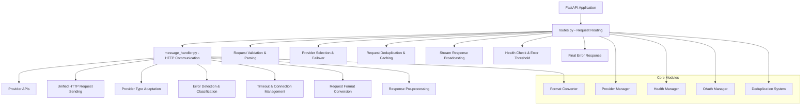
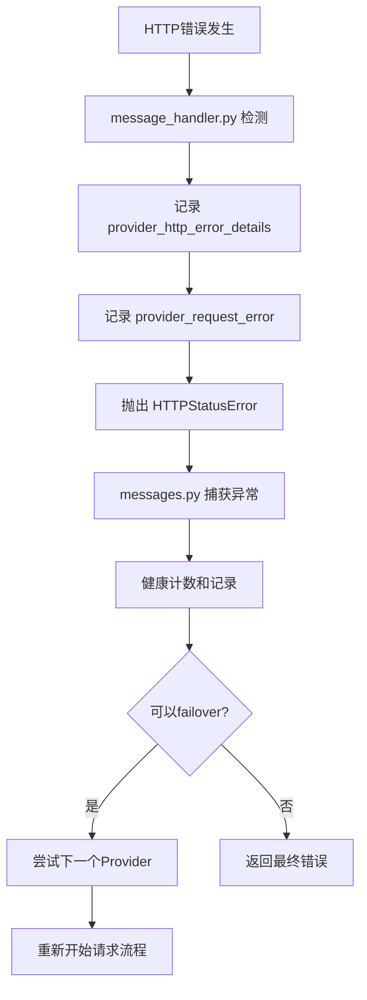

# Request Processing Flow Documentation

## Overview

This document provides a comprehensive overview of how the Claude Code Provider Balancer processes both streaming and non-streaming requests from initial reception to final cleanup, based on the modular architecture with clear separation between routing logic and HTTP communication.

## Table of Contents

- [Architecture Overview](#architecture-overview)
- [Request Lifecycle](#request-lifecycle)
- [Component Responsibilities](#component-responsibilities)
- [Streaming Request Flow](#streaming-request-flow)
- [Non-Streaming Request Flow](#non-streaming-request-flow)
- [Error Handling and Failover](#error-handling-and-failover)
- [Request Deduplication and Caching](#request-deduplication-and-caching)
- [Health Monitoring](#health-monitoring)
- [Logging and Observability](#logging-and-observability)

## Architecture Overview



## Request Lifecycle

```mermaid
graph TD
    A[Client Request] --> B[routes.py - Request Reception]
    B --> C[Request Validation & Parsing]
    C --> D[Generate Request Signature]
    D --> E{Duplicate Request?}
    E -->|Yes| F[Wait for Original Request]
    E -->|No| G[Select Provider Options]
    G --> H[message_handler.py - Processing]
    H --> I[Send HTTP Request]
    I --> J{HTTP Status Code}
    J -->|>=400| K[Record Error Logs]
    J -->|<400| L[Normal Response]
    K --> M[Throw HTTPStatusError]
    M --> N[routes.py - Catch Exception]
    N --> O[Health Check & Error Counting]
    O --> P{Should Mark Unhealthy?}
    P -->|Yes| Q[Mark Provider Unhealthy & Trigger Failover]
    P -->|No| R[Return Error (count=X/Y)]
    Q --> S[Try Next Provider]
    L --> T[Response Processing]
    S --> H
    T --> U[Final Health Check]
    U --> V[Return to Client]
    F --> V
    R --> V
```

## Component Responsibilities

### routes.py (Request Routing Layer)
| Module | Responsibilities |
|--------|------------------|
| **Request Routing** | • FastAPI route handling<br>• Request validation & parsing<br>• Parameter extraction & cleanup |
| **Provider Management** | • Provider selection strategy<br>• Failover logic<br>• Health status monitoring & error counting |
| **Request Deduplication** | • SHA-256 signature generation<br>• Concurrent request merging<br>• Cache management |
| **Response Processing** | • Streaming response broadcasting<br>• Format conversion coordination<br>• Final error response handling |

### message_handler.py (HTTP Communication Layer)
| Module | Responsibilities |
|--------|------------------|
| **HTTP Communication** | • Unified HTTP request sending<br>• Connection pool & timeout management<br>• Proxy configuration |
| **Error Handling** | • HTTP status code validation<br>• Detailed error logging<br>• Exception standardization |
| **Provider Adaptation** | • Anthropic vs OpenAI adaptation<br>• Request format conversion<br>• Header processing |
| **Response Pre-processing** | • Stream response object return<br>• Non-stream response parsing<br>• API error detection |

### Core Modules Overview
| Module | Location | Purpose |
|--------|----------|---------|
| **Provider Manager** | `src/core/provider_manager/` | Provider lifecycle, selection, and health management |
| **Health Manager** | `src/core/provider_manager/health.py` | Error threshold counting and cooldown logic |
| **OAuth Manager** | `src/oauth/oauth_manager.py` | Token management, refresh, and multi-user support |
| **Format Converter** | `src/conversion/` | Anthropic ↔ OpenAI format conversion |
| **Deduplication System** | `src/caching/deduplication.py` | Request deduplication and concurrent response sharing |

## Streaming Request Flow

### Phase 1: Request Preparation (routes.py)
```python
# 1. 接收和验证请求
raw_body = await request.body()
parsed_body = json.loads(raw_body.decode('utf-8'))
messages_request = MessagesRequest.model_validate(parsed_body)

# 2. 生成签名并检查重复
signature = generate_request_signature(parsed_body)

# 3. 选择Provider选项
provider_options = provider_manager.select_model_and_provider_options(
    messages_request.model
)
```

### Phase 2: Provider Communication (message_handler.py)
```python
# 1. 根据Provider类型调用相应方法
if current_provider.type == ProviderType.ANTHROPIC:
    response = await message_handler.make_anthropic_request(
        current_provider, clean_request_body, request_id, 
        messages_request.stream, original_headers
    )

# 2. 统一HTTP请求处理 (make_provider_request)
async with httpx.AsyncClient(timeout=timeout_config) as client:
    response = await client.post(url, json=data, headers=headers)
    
    # 3. 统一错误检查 (流式和非流式)
    if response.status_code >= 400:
        # 记录详细错误日志
        error_file_only(LogRecord(
            event=LogEvent.PROVIDER_HTTP_ERROR_DETAILS.value,
            message=f"Provider {provider.name} returned HTTP {response.status_code}"
        ))
        
        # 抛出标准化异常
        raise HTTPStatusError(...)
    
    # 4. 返回响应对象 (流式请求)
    if stream:
        return response
```

### Phase 3: Stream Processing (routes.py)
```python
# 1. 创建并注册广播器
broadcaster = create_broadcaster(request, request_id, current_provider.name)
register_broadcaster(signature, broadcaster)

# 2. 处理流式响应
async def stream_anthropic_response():
    async for chunk in response.aiter_text():
        collected_chunks.append(chunk)
        yield chunk

# 3. 并发广播
async for chunk in broadcaster.stream_from_provider(stream_anthropic_response()):
    yield chunk

# 4. 健康检查和清理
finally:
    # 检查响应内容健康状态
    is_error_detected, error_reason = validate_response_health(
        collected_chunks, None, 
        provider_manager.settings.get('unhealthy_http_codes', []),
        provider_manager.settings.get('unhealthy_response_body_patterns', [])
    )
    
    # 记录健康检查结果
    should_mark_unhealthy = provider_manager.record_health_check_result(
        current_provider.name, is_error_detected, error_reason, request_id
    )
```

## Non-Streaming Request Flow

### Phase 1: Request Processing
```python
# 同样的Provider选择和HTTP通信流程
response = await message_handler.make_anthropic_request(...)
```

### Phase 2: Response Handling (routes.py)
```python
# 1. 格式转换 (如果是OpenAI Provider)
if current_provider.type == ProviderType.OPENAI:
    anthropic_response = convert_openai_to_anthropic_response(response, request_id)
    response_content = anthropic_response.model_dump()
else:
    # Anthropic provider 直接使用
    response_content = response.json()

# 2. 健康检查
is_error_detected, error_reason = validate_response_health(
    response_content, response.status_code,
    provider_manager.settings.get('unhealthy_http_codes', []),
    provider_manager.settings.get('unhealthy_response_body_patterns', [])
)

# 3. 返回响应
return JSONResponse(content=response_content, headers=response_headers)
```

## Error Handling and Failover

### Unified Error Processing Chain



### Error Handling Strategy

| 错误类型 | 处理位置 | 日志记录 | Failover策略 |
|----------|----------|----------|--------------|
| **网络连接错误** | message_handler.py | • provider_request_error | 总是failover |
| **HTTP 4xx错误** | message_handler.py | • provider_http_error_details<br>• provider_request_error | 根据错误类型决定 |
| **HTTP 5xx错误** | message_handler.py | • provider_http_error_details<br>• provider_request_error | 总是failover |
| **响应体错误** | messages.py | • provider_request_error | 根据健康检查结果 |

### Health Check and Error Threshold System

```python
# Error threshold-based health management
should_mark_unhealthy = provider_manager.record_health_check_result(
    provider_name, is_error_detected, error_reason, request_id
)

# Failover decision based on error threshold
if should_mark_unhealthy:
    # Error count reached threshold - mark provider unhealthy and trigger failover
    current_provider.mark_failure()
    warning(LogRecord(
        LogEvent.PROVIDER_UNHEALTHY_NON_STREAM.value,
        f"Provider {provider.name} marked unhealthy after reaching error threshold",
        request_id
    ))
    # Continue to next provider
else:
    # Error count below threshold - return error directly to client
    error_status = provider_manager.get_provider_error_status(provider_name)
    debug(LogRecord(
        LogEvent.PROVIDER_ERROR_BELOW_THRESHOLD.value,
        f"Provider not marked unhealthy (count={error_count}/{threshold}), returning error to client",
        request_id
    ))
    return error_response
```

### Error Types Triggering Unhealthy Status

```python
# Network and connection errors
UNHEALTHY_ERROR_TYPES = [
    "connection_error", "timeout_error", "ssl_error",
    "internal_server_error", "bad_gateway", "service_unavailable",
    "too_many_requests", "rate_limit_exceeded",
    "Insufficient credits", "没有可用token", "无可用模型"
]

# HTTP status codes triggering unhealthy marking
UNHEALTHY_HTTP_CODES = [402, 404, 408, 429, 500, 502, 503, 504, 520, 521, 522, 523, 524]

# Cooldown and recovery settings
FAILURE_COOLDOWN = 180  # seconds
UNHEALTHY_THRESHOLD = 2  # errors before marking unhealthy
```

## Request Deduplication and Caching

### Signature Generation
```python
def generate_request_signature(request_body: dict) -> str:
    """生成请求签名用于去重"""
    # 移除provider参数，标准化内容
    normalized = {k: v for k, v in request_body.items() if k != "provider"}
    content = json.dumps(normalized, sort_keys=True)
    return hashlib.sha256(content.encode('utf-8')).hexdigest()[:16]
```

### Duplicate Request Handling
```python
# 检查重复请求
if signature in active_requests:
    # 等待原始请求完成
    return await handle_duplicate_request(signature, request_id)

# 注册新请求
active_requests[signature] = (request_future, request_id)
```

### Parallel Broadcasting (Streaming)
```python
# 为流式请求创建广播器
broadcaster = create_broadcaster(request, request_id, provider_name)

# 支持多客户端并发接收
async for chunk in broadcaster.stream_from_provider(provider_stream):
    yield chunk  # 同时发送给所有连接的客户端
```

## Health Monitoring

### Provider Health States
```python
class ProviderHealthManager:
    def record_health_check_result(self, provider_name: str, 
                                 is_error_detected: bool, 
                                 error_reason: str) -> bool:
        """
        返回是否应该标记为unhealthy并触发failover
        """
        if is_error_detected:
            self._error_counts[provider_name] += 1
            if self._error_counts[provider_name] >= self.unhealthy_threshold:
                return True  # 触发failover
        else:
            # 成功请求重置错误计数
            self._error_counts[provider_name] = 0
        return False
```

### Health Check Criteria
```python
def should_mark_unhealthy(http_status_code: int, 
                         error_message: str,
                         exception_type: str) -> Tuple[bool, str]:
    """判断是否应该标记为unhealthy"""
    
    # 1. HTTP状态码判断 (最高优先级)
    if http_status_code in unhealthy_http_codes:
        return True, f"http_status_{http_status_code}"
    
    # 2. 网络异常类型判断
    network_exceptions = ['ConnectError', 'TimeoutError', 'SSLError']
    if any(exc in exception_type for exc in network_exceptions):
        return True, f"network_exception_{exception_type.lower()}"
    
    # 3. 错误消息模式匹配
    for pattern in unhealthy_error_patterns:
        if pattern.lower() in error_message.lower():
            return True, f"error_pattern_{pattern}"
    
    return False, "healthy"
```

## Logging and Observability

### Comprehensive Error Logging

| Log Event | Location | Level | Purpose |
|-----------|----------|-------|---------|
| `provider_request` | message_handler.py | INFO | Record start of provider request |
| `provider_http_error_details` | message_handler.py | ERROR (file only) | Detailed HTTP error information |
| `provider_request_error` | message_handler.py + routes.py | ERROR | Overall request failure log |
| `provider_health_error_recorded` | health.py | DEBUG | Health check error recording |
| `provider_marked_unhealthy` | health.py | WARNING | Provider marked as unhealthy |
| `provider_error_below_threshold` | routes.py | DEBUG | Error count below threshold (count=X/Y) |
| `provider_unhealthy_non_stream` | routes.py | WARNING | Provider unhealthy for non-stream requests |
| `request_failure` | routes.py | ERROR | Final request failure |

### Structured Error Information
```python
# 增强的错误信息记录
if is_error_detected:
    preview, full_content = create_error_preview(response_content)
    error(LogRecord(
        event=LogEvent.PROVIDER_REQUEST_ERROR.value,
        message=f"Provider {provider.name} request failed: {error_reason} - Response preview: {preview}",
        request_id=request_id,
        data={
            "provider": provider.name,
            "error_reason": error_reason,
            "response_preview": preview,          # 控制台显示
            "full_response_body": full_content,   # 日志文件记录
            "request_type": "streaming" or "non-streaming",
            "http_status_code": status_code
        }
    ))
```

### Performance Metrics
```python
# 请求性能统计
{
    "duration_ms": elapsed_time * 1000,
    "provider": current_provider.name,
    "model": target_model,
    "input_tokens": token_count,
    "output_tokens": response_tokens,
    "stream": is_streaming,
    "status": "success" or "failed"
}
```

## Key Design Principles

### 1. Separation of Concerns
- **routes.py**: Focuses on business flow, routing logic, and failover strategy
- **message_handler.py**: Focuses on HTTP communication, error handling, and protocol adaptation
- **Core modules**: Specialized functionality (provider management, health monitoring, OAuth, etc.)

### 2. Error Threshold-Based Health Management
- All HTTP errors are uniformly detected and recorded in `message_handler.py`
- Error threshold counting prevents premature provider marking as unhealthy
- Standardized exception throwing and error log formatting
- Consistent health check and failover logic with `count=X/Y` visibility

### 3. Transparent Failover with Smart Decision Making
- User-transparent provider switching based on error thresholds
- Intelligent error classification and retry strategies
- Health state management with automatic recovery via cooldown periods
- Granular logging for debugging with structured LogEvent enums

### 4. High Availability and Performance
- Request deduplication using SHA-256 signatures to avoid duplicate processing
- Concurrent streaming response broadcasting for multiple clients
- OAuth token management with automatic refresh and multi-user support
- Comprehensive resource cleanup and error recovery mechanisms

### 5. Production-Ready Observability
- Structured JSON logging with LogEvent enumeration for consistency
- Real-time provider health monitoring with `/providers` endpoint
- Configuration hot-reload without service interruption
- Performance metrics and error tracking for operational insights

This modular architecture ensures reliable request processing with clear responsibilities, intelligent error handling, and comprehensive observability optimized for production deployments with high availability requirements.