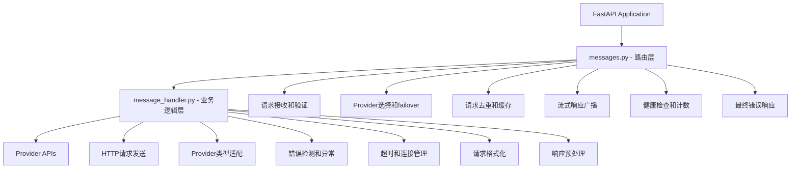
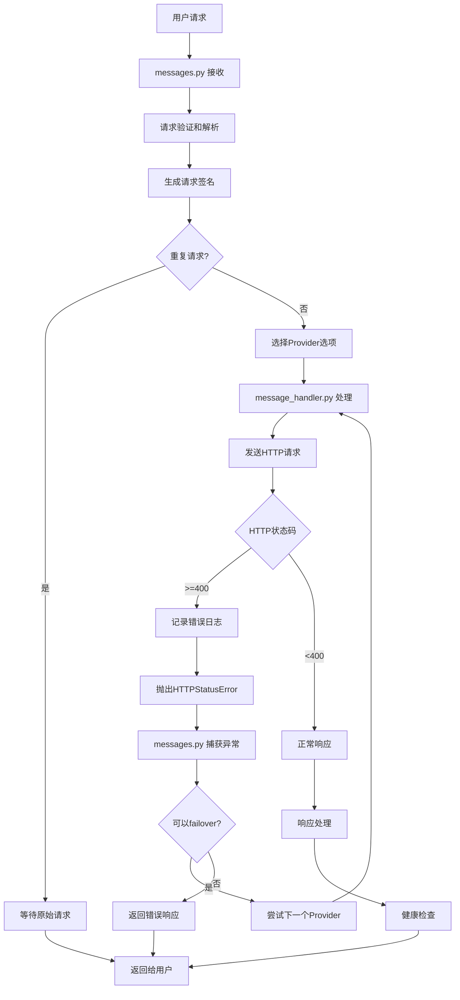
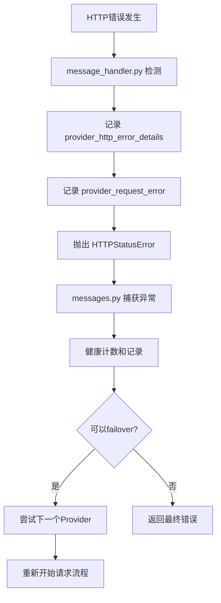

# Request Processing Flow Documentation

## Overview

This document provides a comprehensive overview of how the Claude Code Provider Balancer processes both streaming and non-streaming requests from initial reception to final cleanup, based on the modular architecture with clear separation between routing logic and HTTP communication.

## Table of Contents

- [Architecture Overview](#architecture-overview)
- [Request Lifecycle](#request-lifecycle)
- [Component Responsibilities](#component-responsibilities)
- [Streaming Request Flow](#streaming-request-flow)
- [Non-Streaming Request Flow](#non-streaming-request-flow)
- [Error Handling and Failover](#error-handling-and-failover)
- [Request Deduplication and Caching](#request-deduplication-and-caching)
- [Health Monitoring](#health-monitoring)
- [Logging and Observability](#logging-and-observability)

## Architecture Overview



## Request Lifecycle



## Component Responsibilities

### messages.py (路由层)
| 功能模块 | 具体职责 |
|----------|----------|
| **请求路由** | • FastAPI 路由处理<br>• 请求验证和解析<br>• 参数提取和清理 |
| **Provider管理** | • Provider 选择策略<br>• Failover 逻辑<br>• 健康状态检查和计数 |
| **请求去重** | • 签名生成和匹配<br>• 并发请求合并<br>• 缓存管理 |
| **响应处理** | • 流式响应广播<br>• 格式转换协调<br>• 最终错误响应 |

### message_handler.py (业务逻辑层)
| 功能模块 | 具体职责 |
|----------|----------|
| **HTTP通信** | • 统一HTTP请求发送<br>• 连接池和超时管理<br>• 代理配置 |
| **错误处理** | • HTTP状态码检查<br>• 错误日志记录<br>• 异常标准化 |
| **Provider适配** | • Anthropic vs OpenAI 适配<br>• 请求格式化<br>• 头部处理 |
| **响应预处理** | • 流式响应对象返回<br>• 非流式响应解析<br>• API错误检测 |

## Streaming Request Flow

### Phase 1: Request Preparation (messages.py)
```python
# 1. 接收和验证请求
raw_body = await request.body()
parsed_body = json.loads(raw_body.decode('utf-8'))
messages_request = MessagesRequest.model_validate(parsed_body)

# 2. 生成签名并检查重复
signature = generate_request_signature(parsed_body)

# 3. 选择Provider选项
provider_options = provider_manager.select_model_and_provider_options(
    messages_request.model
)
```

### Phase 2: Provider Communication (message_handler.py)
```python
# 1. 根据Provider类型调用相应方法
if current_provider.type == ProviderType.ANTHROPIC:
    response = await message_handler.make_anthropic_request(
        current_provider, clean_request_body, request_id, 
        messages_request.stream, original_headers
    )

# 2. 统一HTTP请求处理 (make_provider_request)
async with httpx.AsyncClient(timeout=timeout_config) as client:
    response = await client.post(url, json=data, headers=headers)
    
    # 3. 统一错误检查 (流式和非流式)
    if response.status_code >= 400:
        # 记录详细错误日志
        error_file_only(LogRecord(
            event=LogEvent.PROVIDER_HTTP_ERROR_DETAILS.value,
            message=f"Provider {provider.name} returned HTTP {response.status_code}"
        ))
        
        # 抛出标准化异常
        raise HTTPStatusError(...)
    
    # 4. 返回响应对象 (流式请求)
    if stream:
        return response
```

### Phase 3: Stream Processing (messages.py)
```python
# 1. 创建并注册广播器
broadcaster = create_broadcaster(request, request_id, current_provider.name)
register_broadcaster(signature, broadcaster)

# 2. 处理流式响应
async def stream_anthropic_response():
    async for chunk in response.aiter_text():
        collected_chunks.append(chunk)
        yield chunk

# 3. 并发广播
async for chunk in broadcaster.stream_from_provider(stream_anthropic_response()):
    yield chunk

# 4. 健康检查和清理
finally:
    # 检查响应内容健康状态
    is_error_detected, error_reason = validate_response_health(
        collected_chunks, None, 
        provider_manager.settings.get('unhealthy_http_codes', []),
        provider_manager.settings.get('unhealthy_response_body_patterns', [])
    )
    
    # 记录健康检查结果
    should_mark_unhealthy = provider_manager.record_health_check_result(
        current_provider.name, is_error_detected, error_reason, request_id
    )
```

## Non-Streaming Request Flow

### Phase 1: Request Processing
```python
# 同样的Provider选择和HTTP通信流程
response = await message_handler.make_anthropic_request(...)
```

### Phase 2: Response Handling (messages.py)
```python
# 1. 格式转换 (如果是OpenAI Provider)
if current_provider.type == ProviderType.OPENAI:
    anthropic_response = convert_openai_to_anthropic_response(response, request_id)
    response_content = anthropic_response.model_dump()
else:
    # Anthropic provider 直接使用
    response_content = response.json()

# 2. 健康检查
is_error_detected, error_reason = validate_response_health(
    response_content, response.status_code,
    provider_manager.settings.get('unhealthy_http_codes', []),
    provider_manager.settings.get('unhealthy_response_body_patterns', [])
)

# 3. 返回响应
return JSONResponse(content=response_content, headers=response_headers)
```

## Error Handling and Failover

### Unified Error Processing Chain



### Error Handling Strategy

| 错误类型 | 处理位置 | 日志记录 | Failover策略 |
|----------|----------|----------|--------------|
| **网络连接错误** | message_handler.py | • provider_request_error | 总是failover |
| **HTTP 4xx错误** | message_handler.py | • provider_http_error_details<br>• provider_request_error | 根据错误类型决定 |
| **HTTP 5xx错误** | message_handler.py | • provider_http_error_details<br>• provider_request_error | 总是failover |
| **响应体错误** | messages.py | • provider_request_error | 根据健康检查结果 |

### Health Check and Provider Management

```python
# 健康状态记录
should_mark_unhealthy = provider_manager.record_health_check_result(
    provider_name, is_error_detected, error_reason, request_id
)

# Failover决策
if should_mark_unhealthy:
    # 标记Provider不健康并尝试failover
    current_provider.mark_failure()
    # 继续尝试下一个Provider
else:
    # 错误计数未达阈值，直接返回错误给客户端
    return error_response
```

## Request Deduplication and Caching

### Signature Generation
```python
def generate_request_signature(request_body: dict) -> str:
    """生成请求签名用于去重"""
    # 移除provider参数，标准化内容
    normalized = {k: v for k, v in request_body.items() if k != "provider"}
    content = json.dumps(normalized, sort_keys=True)
    return hashlib.sha256(content.encode('utf-8')).hexdigest()[:16]
```

### Duplicate Request Handling
```python
# 检查重复请求
if signature in active_requests:
    # 等待原始请求完成
    return await handle_duplicate_request(signature, request_id)

# 注册新请求
active_requests[signature] = (request_future, request_id)
```

### Parallel Broadcasting (Streaming)
```python
# 为流式请求创建广播器
broadcaster = create_broadcaster(request, request_id, provider_name)

# 支持多客户端并发接收
async for chunk in broadcaster.stream_from_provider(provider_stream):
    yield chunk  # 同时发送给所有连接的客户端
```

## Health Monitoring

### Provider Health States
```python
class ProviderHealthManager:
    def record_health_check_result(self, provider_name: str, 
                                 is_error_detected: bool, 
                                 error_reason: str) -> bool:
        """
        返回是否应该标记为unhealthy并触发failover
        """
        if is_error_detected:
            self._error_counts[provider_name] += 1
            if self._error_counts[provider_name] >= self.unhealthy_threshold:
                return True  # 触发failover
        else:
            # 成功请求重置错误计数
            self._error_counts[provider_name] = 0
        return False
```

### Health Check Criteria
```python
def should_mark_unhealthy(http_status_code: int, 
                         error_message: str,
                         exception_type: str) -> Tuple[bool, str]:
    """判断是否应该标记为unhealthy"""
    
    # 1. HTTP状态码判断 (最高优先级)
    if http_status_code in unhealthy_http_codes:
        return True, f"http_status_{http_status_code}"
    
    # 2. 网络异常类型判断
    network_exceptions = ['ConnectError', 'TimeoutError', 'SSLError']
    if any(exc in exception_type for exc in network_exceptions):
        return True, f"network_exception_{exception_type.lower()}"
    
    # 3. 错误消息模式匹配
    for pattern in unhealthy_error_patterns:
        if pattern.lower() in error_message.lower():
            return True, f"error_pattern_{pattern}"
    
    return False, "healthy"
```

## Logging and Observability

### Comprehensive Error Logging

| 日志事件 | 记录位置 | 级别 | 用途 |
|----------|----------|------|------|
| `provider_request` | message_handler.py | INFO | 记录开始请求Provider |
| `provider_http_error_details` | message_handler.py | ERROR (仅文件) | HTTP错误详细信息 |
| `provider_request_error` | message_handler.py + messages.py | ERROR | 请求失败总体日志 |
| `provider_health_error_recorded` | health.py | DEBUG | 健康检查错误记录 |
| `provider_marked_unhealthy` | health.py | WARNING | Provider标记为不健康 |
| `request_failure` | messages.py | ERROR | 最终请求失败 |

### Structured Error Information
```python
# 增强的错误信息记录
if is_error_detected:
    preview, full_content = create_error_preview(response_content)
    error(LogRecord(
        event=LogEvent.PROVIDER_REQUEST_ERROR.value,
        message=f"Provider {provider.name} request failed: {error_reason} - Response preview: {preview}",
        request_id=request_id,
        data={
            "provider": provider.name,
            "error_reason": error_reason,
            "response_preview": preview,          # 控制台显示
            "full_response_body": full_content,   # 日志文件记录
            "request_type": "streaming" or "non-streaming",
            "http_status_code": status_code
        }
    ))
```

### Performance Metrics
```python
# 请求性能统计
{
    "duration_ms": elapsed_time * 1000,
    "provider": current_provider.name,
    "model": target_model,
    "input_tokens": token_count,
    "output_tokens": response_tokens,
    "stream": is_streaming,
    "status": "success" or "failed"
}
```

## Key Design Principles

### 1. Separation of Concerns
- **messages.py**: 专注于业务流程、路由逻辑、failover策略
- **message_handler.py**: 专注于HTTP通信、错误处理、协议适配

### 2. Unified Error Handling
- 所有HTTP错误都在`message_handler.py`中统一检测和记录
- 标准化的异常抛出和错误日志格式
- 一致的健康检查和failover逻辑

### 3. Transparent Failover
- 用户无感知的Provider切换
- 智能的错误分类和重试策略
- 健康状态管理和自动恢复

### 4. High Availability
- 请求去重避免重复处理
- 流式响应的并发广播
- 完善的资源清理和错误恢复

This modular architecture ensures reliable request processing with clear responsibilities, unified error handling, and comprehensive observability for production deployments.