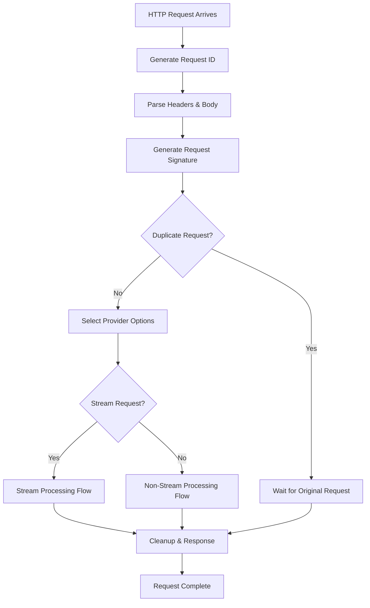

# Request Processing Flow Documentation

## Overview

This document provides a comprehensive overview of how the Claude Code Provider Balancer processes both streaming and non-streaming requests from initial reception to final cleanup.

## Table of Contents

- [Request Lifecycle Overview](#request-lifecycle-overview)
- [Common Request Reception Phase](#common-request-reception-phase)
- [Streaming Request Flow](#streaming-request-flow)
- [Non-Streaming Request Flow](#non-streaming-request-flow)
- [Request Cleanup and Resource Management](#request-cleanup-and-resource-management)
- [Failover and Retry Mechanism](#failover-and-retry-mechanism)
- [Key Implementation Details](#key-implementation-details)

## Request Lifecycle Overview



## Common Request Reception Phase

All requests go through the following initial steps:

### 1. Request Reception (`src/main.py:2143`)
- **Entry Point**: `POST /v1/messages`
- **Request ID Generation**: Each request gets a unique UUID
- **Timing Start**: Record monotonic start time for duration tracking

### 2. Header and Body Processing
```python
# Extract original request headers
original_headers = dict(request.headers)

# Parse JSON body into MessagesRequest
raw_body = await request.json()
anthropic_request = MessagesRequest.model_validate(raw_body)
```

### 3. Request Deduplication (`src/main.py:153-311`)
- **Signature Generation**: `_generate_request_signature()` creates SHA256 hash
- **Duplicate Detection**: Check `_pending_requests` dictionary
- **Stream Exception**: Streaming requests bypass deduplication for safety

### 4. Provider Selection (`src/main.py:1997-2040`)
- **Model Mapping**: Map client model to available providers
- **Health Check**: Filter out unhealthy providers
- **Priority Ordering**: Return sorted list of provider options

## Streaming Request Flow

### Phase 1: Request Preparation
```python
# Check if streaming is requested
is_stream = anthropic_request.stream or False

# Get provider options with fallback capability
provider_options = select_target_model_and_provider_options(
    anthropic_request.model, request_id
)
```

### Phase 2: Provider-Specific Processing

#### For Anthropic Providers (`src/main.py:2290-2612`)
1. **Direct Request**: Send original Anthropic format
2. **Pre-read Validation** (`src/main.py:2320-2382`):
   - Read first 5 lines to detect `event: error`
   - Apply timeout protection
   - Trigger failover if error detected
3. **Stream Generation**: `anthropic_stream_generator()` handles SSE forwarding

#### For OpenAI-Compatible Providers (`src/main.py:2647-2742`)
1. **Format Conversion**: Convert Anthropic to OpenAI format
2. **Stream Processing**: `handle_anthropic_streaming_response_from_openai_stream()`
3. **Format Translation**: Convert OpenAI SSE back to Anthropic format

### Phase 3: Streaming Monitoring (`src/main.py:2418-2504`)
```python
# Timeout controls
streaming_timeout = provider_manager.settings.get('streaming_timeout', 120)
streaming_activity_timeout = provider_manager.settings.get('streaming_activity_timeout', 30)

# Real-time monitoring
current_time = time.time()
if current_time - streaming_start_time > streaming_timeout:
    raise asyncio.TimeoutError(f"Streaming timeout after {streaming_timeout}s")
```

### Phase 4: Success Handling
- **Completion Detection**: Only mark success after full stream completion
- **Provider Status**: Call `provider.mark_success()` 
- **Statistics**: Record lines streamed, bytes transferred, duration

## Non-Streaming Request Flow

### Phase 1: Request Processing
```python
# Same provider selection as streaming
target_model_name, current_provider = provider_options[0]

# Provider-specific handling
if current_provider.type == ProviderType.ANTHROPIC:
    # Direct Anthropic API call
    response = await make_anthropic_request(...)
else:
    # OpenAI-compatible provider
    response = await make_openai_request(...)
```

### Phase 2: Response Handling

#### Anthropic Provider Response
- **Direct Return**: JSON response returned as-is
- **Immediate Success**: Mark provider successful upon completion

#### OpenAI Provider Response  
- **Format Conversion**: `convert_openai_to_anthropic_response()`
- **Token Mapping**: Map usage statistics
- **Stop Reason Translation**: Convert OpenAI finish reasons to Anthropic format

### Phase 3: Response Packaging
```python
# Wrap in JSONResponse
response = JSONResponse(content=anthropic_response_data)

# Apply cleanup
return await _complete_request_and_cleanup(response)
```

## Request Cleanup and Resource Management

### Deduplication State Cleanup (`src/main.py:203-242`)
```python
def _complete_and_cleanup_request(signature: str, result: Any):
    """Complete request and clean up deduplication state"""
    with _request_cleanup_lock:
        if signature in _pending_requests:
            future, original_request_id = _pending_requests[signature]
            if not future.done():
                future.set_result(result)
            del _pending_requests[signature]
```

### Provider State Management
- **Success Path**: `provider.mark_success()` resets failure counters
- **Failure Path**: `provider.mark_failure()` initiates cooldown period
- **Statistics Recording**: Duration, tokens, status codes

### Resource Cleanup Triggers
1. **Successful Completion**: Response fully sent to client
2. **Exception Handling**: Network errors, timeouts, provider failures  
3. **Client Disconnection**: Early termination by client
4. **System Errors**: Internal processing exceptions

## Failover and Retry Mechanism

### Error Classification (`provider_manager.py`)
```python
error_type, should_failover = provider_manager.get_error_classification(
    exception, http_status_code
)
```

### Failover Decision Matrix
| Error Type | HTTP Status | Action |
|------------|-------------|---------|
| Network Timeout | N/A | Failover |
| 4xx Client Error | 400-499 | No Failover* |
| 5xx Server Error | 500-599 | Failover |
| Stream Error Event | 200 | Failover |

*Except for specific retryable 4xx errors

### Retry Process
1. **Provider Failure**: Mark current provider as failed
2. **Option Selection**: Get next provider from `provider_options`
3. **Request Retry**: Repeat entire request with new provider
4. **Final Failure**: Return 503 if all providers exhausted

## Key Implementation Details

### Request Signatures and Deduplication
- **Stream Bypass**: Streaming requests get unique signatures to prevent deduplication
- **Hash Generation**: SHA256 of normalized request parameters
- **Thread Safety**: Protected by `_request_cleanup_lock`

### Timeout Management
```python
# Multiple timeout layers
request_timeout = provider_manager.get_request_timeout()     # HTTP request
streaming_timeout = settings.get('streaming_timeout', 120)  # Total stream time
activity_timeout = settings.get('streaming_activity_timeout', 30)  # Inactivity
```

### Error Event Detection (Streaming)
```python
# Pre-read phase detects errors early
if line.strip() == "event: error":
    error_data = json.loads(data_line[6:])
    error_type = error_data.get("error", {}).get("type")
    raise Exception(f"Provider returned error: {error_type}")
```

### Provider Health Management
- **Cooldown Period**: Failed providers excluded for configurable time
- **Automatic Recovery**: Providers rejoin pool after cooldown expires
- **Success Bias**: Recent successful providers preferred during active periods

## Monitoring and Observability

### Logging Events
- `request_received`: Initial request logging
- `provider_request_failed`: Individual provider failures
- `provider_fallback`: Failover transitions
- `request_completed`: Successful completions
- `streaming_timeout`: Timeout events

### Metrics Tracked
- Request duration (`duration_ms`)
- Token usage (`input_tokens`, `output_tokens`)
- Provider performance and health status
- Streaming statistics (lines, bytes, duration)

### Debug Information
- Request signatures for deduplication analysis
- Provider selection reasoning
- Raw streaming data samples
- Error classification decisions

This comprehensive flow ensures reliable request processing with intelligent failover, proper resource management, and detailed observability for production deployments.